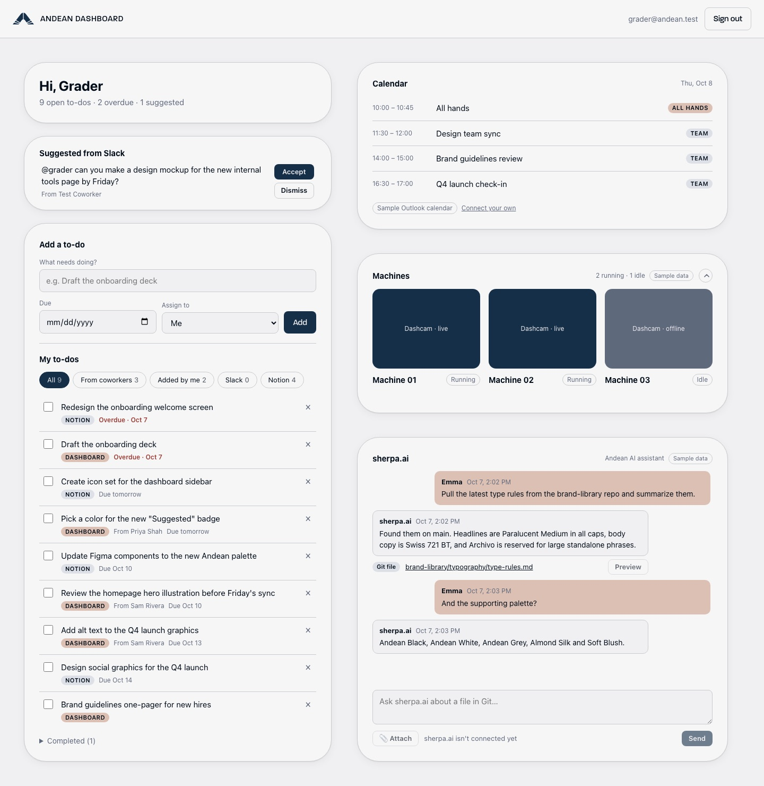
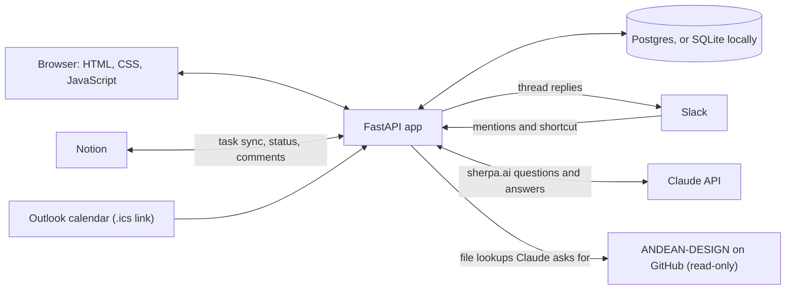

# Andean Dashboard

An internal dashboard for Andean employees. It turns Slack requests, Notion tasks and to-dos from coworkers into one to-do list, and shows today's Outlook meetings and **sherpa.ai**, an assistant that answers questions from Andean's brand asset library.

**Live demo:** https://andean-dashboard-demo.onrender.com (password-protected)



## Try the demo

1. Open https://andean-dashboard-demo.onrender.com. On Render's free plan, the first visit after 15 quiet minutes shows a wake-up screen for up to a minute.
2. Sign in with any `@andean.test` email, for example `grader@andean.test`, and the demo passphrase. The passphrase is shared separately and isn't in this repo.
3. Each new email starts with sample data:
   - to-dos from two sample coworkers, Priya Shah and Sam Rivera;
   - five sample Notion tasks;
   - a sample Slack request to accept or dismiss;
   - a sample Outlook calendar.
4. Click any to-do to open its task panel, or ask sherpa.ai about Andean's logos, colors or type.

What you check off or accept is saved, so it's still there the next time you sign in with the same email. The demo never connects to Andean's real Slack, Notion or Microsoft accounts.

## What it does

The dashboard collects to-dos from three places into one list:

- **Dashboard:** to-dos you add yourself or that coworkers send you.
- **Notion:** tasks assigned to you in a Notion tasks database. Checking one off on the dashboard marks it done in Notion.
- **Slack:** messages and threads that @mention you show up as *suggested* to-dos you can accept or dismiss. The "Add to dashboard" message shortcut saves any message as a to-do.

**Click any to-do** to open its task panel and work on it without leaving the dashboard:

- **Slack:** the full thread, with a reply box. Replies post as you when your Slack user token is set; otherwise they post as the Andean Dashboard bot, signed with your name.
- **Notion:** the page's content and comments. Change the status or due date (written back to Notion) and add comments.
- **From a coworker:** a conversation with the person who sent it.
- **Attach files** (📎 or paste) to any reply, up to 10 MB each. Coworker conversations show them inline. Notion comments get them as real Notion attachments, up to 3. Slack replies upload them when the app has `files:write`, and otherwise include a link to the file on the dashboard.
- **Linked docs:** Figma files and Google Docs, Sheets and Slides preview inline. Linked Notion pages render inside the panel when they're shared with the connection.

The right-hand column follows the Figma "Dashboard" frame:

- **Calendar:** today's meetings from each person's own Outlook calendar. In the demo and locally, it shows a labelled sample calendar until they connect theirs; production never does.
- **Machines:** collapses to one line. It shows labelled sample data until a real source is connected.
- **sherpa.ai:** answers questions by reading the ANDEAN-DESIGN repo on GitHub (read-only) and attaches the files it used so they can be previewed. Until it's connected, it shows a labelled sample chat.

**Signing in:** employees use their Andean Microsoft (Outlook) account. The login page, built from the Figma design, takes their work email, then hands off to Microsoft's own page, prefilled, for the password and any two-factor code. The dashboard never sees or stores passwords. **Remember me** keeps them signed in for 30 days instead of 8 hours, and **Forgot?** opens Microsoft's password reset.

## How it works



Each synced to-do remembers where it came from (its source and the Slack message or Notion page ID), so syncing again updates it instead of creating a duplicate. Dismissed suggestions never come back.

## Tech stack

- **Backend:** Python, FastAPI and SQLAlchemy. Postgres in the demo (a free [Neon](https://neon.com) database) and SQLite locally.
- **Front end:** plain HTML, CSS and JavaScript, no framework. Designed in Figma with the Andean palette and logomark from ANDEAN-DESIGN.
- **Integrations:** Slack (`slack_sdk`, Socket Mode), the Notion API, Outlook calendars (`icalendar`), Microsoft sign-in (MSAL), and the Claude API with the GitHub API for sherpa.ai.
- **Hosting:** Render.
- **Built with:** Claude Code. Every prompt is in [PROMPT_LOG.md](PROMPT_LOG.md).

## Security

- **Sign-in:** Microsoft handles passwords, so the app never sees them. The demo uses a shared passphrase of at least 16 characters, with rate limiting (8 tries per visitor, 60 overall per 5 minutes), and only accepts `@andean.test` emails.
- **Sessions:** signed, HTTP-only cookies (`Secure` in production) that last 8 hours, or 30 days with Remember me. Every change needs a CSRF token, pages use a strict Content Security Policy, and no API docs are exposed.
- **Secrets:** keys and tokens live only in environment variables (`.env` on a laptop, Render's settings for the demo), never in the repo or the browser.
- **sherpa.ai:** only signed-in employees can use it. Its GitHub token is read-only for one repo, it refuses paths outside the repo and `.env` files, and it treats file contents as data, not instructions.
- **Outlook links:** only Microsoft's calendar hosts are accepted, including after redirects, so the server can't be pointed anywhere else.

## How it was built

I designed the login page and the dashboard in Figma, then built the app with Claude Code over two days. I tested it against a sandbox Slack workspace and a sandbox Notion workspace that I own, using a second "Test Coworker" account to send requests, so no real company data was involved. It's deployed to Render as a password-protected demo for this class. [PROMPT_LOG.md](PROMPT_LOG.md) has every prompt, with a note on what came of each one.

## Run locally

```bash
python3 -m venv .venv
.venv/bin/pip install -r requirements-dev.txt
cp .env.example .env   # then set SESSION_SECRET (command is in the file)
.venv/bin/uvicorn app.main:app --reload
```

Open http://localhost:8000. Until Microsoft sign-in is configured, use the **Local development sign-in** box. It's only available when `APP_ENV=development` and `DEV_LOGIN=1`, and the app refuses to start if `DEV_LOGIN` is set in production.

Run the tests with `.venv/bin/python -m pytest`. They use a temporary SQLite file; set `TEST_DATABASE_URL` to run them against another database, such as a scratch Postgres.

## Password-protected demo (class portfolio)

`APP_ENV=demo` runs a showcase with no Microsoft, Slack or Notion setup:

- The login page asks for an email and a **shared demo password** (`DEMO_PASSWORD`, at least 16 characters, e.g. a four-word passphrase; the app refuses to start without it). Wrong passwords are rate-limited: 8 tries per visitor and 60 overall per 5 minutes.
- Only emails in `ALLOWED_EMAIL_DOMAINS` (set it to a demo domain like `andean.test`) can sign in, so real company accounts never exist in the demo.
- Each new visitor gets a few starter to-dos from sample coworkers, sample Notion tasks and a sample Slack request to accept or dismiss. What they check off or accept is saved, so it's still there the next time they sign in (with a Postgres `DATABASE_URL`; see below).
- Everything except the login page, static files and `/healthz` requires sign-in.

To make a passphrase, run this locally and copy the result straight into Render:

```bash
python3 -c "import secrets; w=[x.strip().lower() for x in open('/usr/share/dict/words') if 4<=len(x.strip())<=8 and x.strip().isalpha()]; print('-'.join(secrets.choice(w) for _ in range(4)))"
```

On Render: set `APP_ENV=demo`, `DEMO_PASSWORD`, `ALLOWED_EMAIL_DOMAINS=andean.test`, and a generated `SESSION_SECRET`. `BASE_URL` defaults to Render's `RENDER_EXTERNAL_URL`. Also set `DATABASE_URL` to a Postgres database, such as a free [Neon](https://neon.com) database (Render's own free Postgres expires after 30 days). Without it the demo uses a SQLite file, which Render erases whenever the service sleeps, restarts or redeploys, so visitors' changes are lost; the app logs a warning when that's the case.

## Microsoft sign-in setup (needs Andean IT / an Entra admin)

1. Go to the Entra admin center: **App registrations → New registration**.
   - Name: `Andean Dashboard`
   - Supported account types: **Accounts in this organizational directory only** (single tenant)
   - Redirect URI (Web): `https://<your-domain>/auth/callback`. For local testing, add `http://localhost:8000/auth/callback` too.
2. Under **Certificates & secrets**, create a client secret.
3. Set these environment variables:
   - `MS_TENANT_ID`: Directory (tenant) ID
   - `MS_CLIENT_ID`: Application (client) ID
   - `MS_CLIENT_SECRET`: the secret value
4. Optional: set `ALLOWED_EMAIL_DOMAINS` (e.g. `andean.systems`) and `ADMIN_EMAILS`.

Only accounts in the Andean tenant can sign in. An employee record is created the first time someone signs in.

## Slack setup

1. Go to https://api.slack.com/apps → **Create New App → From an app manifest**, pick the workspace, paste [`slack-manifest.yml`](slack-manifest.yml), click **Create**, then **Install to Workspace → Allow**.
2. Copy three values into `.env`:
   - **Basic Information → App Credentials → Signing Secret** → `SLACK_SIGNING_SECRET`
   - **Basic Information → App-Level Tokens → Generate Token and Scopes**: name it `socket`, add the `connections:write` scope, and copy the `xapp-…` token → `SLACK_APP_TOKEN`
   - **OAuth & Permissions → Bot User OAuth Token** (`xoxb-…`) → `SLACK_BOT_TOKEN`
3. Restart the app. It connects over Socket Mode, so no public URL is needed.
4. In every channel where requests happen, run `/invite @Andean Dashboard`. The bot only sees channels it has been invited to.
5. Sign in to the dashboard with the same email as your Slack profile. That match is how mentions find you.
6. **Replying from the task panel (optional):** under **OAuth & Permissions → User Token Scopes**, add `chat:write` (the manifest already includes it), click **Reinstall to Workspace**, and copy the **User OAuth Token** (`xoxp-…`) into `.env` as `SLACK_USER_TOKEN`. Replies then post as the person who owns that token. This is a one-person prototype; a per-employee "Connect Slack" flow comes later.

**Production:** follow the comment at the top of the manifest. Set `socket_mode_enabled: false`, set the request URLs to `https://<BASE_URL>/slack/events` and `/slack/interactions`, and leave `SLACK_APP_TOKEN` unset. Installing in Andean's real workspace needs a Slack admin's approval.

## Notion setup

1. In the Notion workspace, open https://app.notion.com/developers/connections → **Build → Internal connections → Create a new connection** and pick the workspace.
   - Under **Configuration**, enable **Read content**, **Update content** and **Insert content** (only the setup script needs Insert), plus **Read comments** and **Insert comments** for the task panel.
   - Choose **Read user information including email addresses**. Without it, assignees can't be matched to employees.
   - Copy the API token into `.env` as `NOTION_TOKEN`.
2. Create a page (e.g. "Dashboard Sandbox"), open **••• → Connections → + Add connection**, and choose your connection.
3. Build a seeded Tasks database (Name, Assignee, Status, Due) under that page:
   ```bash
   .venv/bin/python scripts/setup_notion_sandbox.py --parent-page "<page URL>" --email <your Notion email>
   ```
4. Add the printed `NOTION_TASKS_DATABASE_ID=…` line to `.env` and restart. Tasks sync every 2 minutes, or right away with **Sync Notion** on the dashboard.

For an existing database, skip the script. Share the database with the connection, put its URL or ID in `NOTION_TASKS_DATABASE_ID`, and set `NOTION_ASSIGNEE_PROPERTY` / `NOTION_STATUS_PROPERTY` / `NOTION_DUE_PROPERTY` if its columns are named differently.

## Outlook calendar

Each employee connects their own calendar from the Calendar panel. No Microsoft app registration is needed:

1. In Outlook on the web, go to **Settings → Calendar → Shared calendars**.
2. Under **Publish a calendar**, choose the calendar and **Can view all details**, then **Publish**.
3. Copy the **ICS** link (ends in `.ics`) and paste it into the Calendar panel.

The link is stored on the server (`calendar_links` table) and only that person's meetings are returned to them. Only `https://outlook.office365.com`, `outlook.office.com` and `outlook.live.com` links are accepted, including after redirects, so the server can't be pointed elsewhere. Unpublishing the calendar in Outlook revokes the link. Once Microsoft sign-in is set up, this can move to Microsoft Graph (`Calendars.Read`).

## sherpa.ai setup

sherpa.ai (`app/sherpa.py`) gives Claude two read-only tools, `list_files` and `read_file`, over GitHub's contents API. It looks through the repo for up to 6 rounds per question, names the files it used, and attaches images and other assets so they can be previewed.

1. **GitHub token:** create a fine-grained personal access token with access to only the one repo, and set **Repository permissions → Contents** to **Read-only**.
2. **Claude API key:** create one in the Claude Console, and set a monthly spending limit there.
3. Set `ANTHROPIC_API_KEY`, `GITHUB_TOKEN`, `GITHUB_REPO` (like `owner/repo`) and, optionally, `GITHUB_BRANCH` (defaults to `main`) in `.env`, or in Render's settings for the demo. Then restart.

The panel says **Git connected** once sherpa.ai can read the repo. Until then it shows the labelled sample chat.

## Project structure

| File | Purpose |
|---|---|
| `app/main.py` | App setup: routes, security headers, static files |
| `app/auth.py` | Microsoft OIDC login, sessions, CSRF |
| `app/demo.py` | Password-protected demo sign-in and starter to-dos |
| `app/todos.py` | To-do API: list, add, send to coworker, complete, delete |
| `app/details.py` | Task panel API: Slack thread and replies, Notion page/comments/edits, coworker conversation, linked-doc previews |
| `app/sherpa.py` | sherpa.ai: Claude with read-only GitHub tools |
| `app/integrations/slack.py` | Slack events + "Add to dashboard" shortcut (Socket Mode or HTTP) |
| `app/integrations/notion.py` | Notion sync and status push-back |
| `app/integrations/outlook.py` | Outlook calendar: link validation, .ics fetch, recurring events in the viewer's time zone |
| `app/integrations/common.py` | Maps Slack/Notion users to employees by email; upserts synced to-dos |
| `app/models.py` | `Employee` (with `slack_user_id` / `notion_user_id` for mapping), `Todo` (with `source` / `source_id` / `source_url`), comments, attachments, calendar links |
| `app/db.py` | Database connection (SQLite or Postgres) |
| `static/index.html`, `static/app.js` | The dashboard page and to-do list |
| `static/panel.js` | The task panel UI |
| `static/widgets.js` | Calendar, Machines and sherpa.ai panels |
| `static/login.html`, `static/login.js` | The login page from the Figma design |
| `scripts/setup_notion_sandbox.py` | Creates a seeded Tasks database in a sandbox Notion workspace |
| `tests/` | Automated tests (`pytest`) |

## Roadmap

1. ~~Foundation: login, personal to-dos~~
2. ~~Send to-dos to coworkers~~ · Direct messages between employees
3. ~~**Notion:** assigned tasks sync in, check-offs sync back~~
4. ~~**Slack v1:** @mentions become suggested to-dos; "Add to dashboard" shortcut~~
5. ~~**Outlook calendar** and **sherpa.ai**~~
6. **Slack v2:** LLM check that a mention is actually a request, and Slack DM notifications when someone sends you a to-do
7. Polish: live updates, admin page, Alembic migrations, Microsoft sign-in in Andean's tenant, a real data source for Machines

**Testing safely:** develop against a sandbox Slack workspace and sandbox Notion workspace you own, not Andean's real ones. Switching later only changes values in `.env`.
